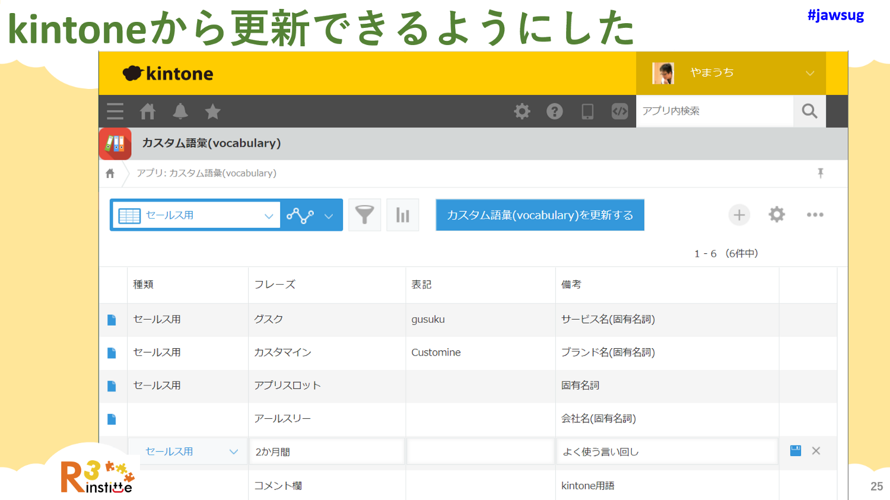
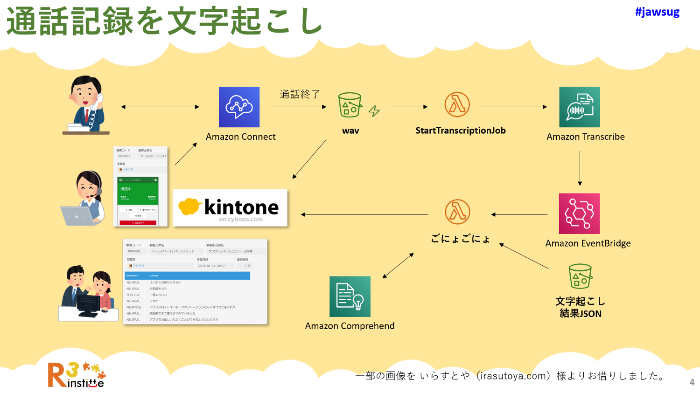

# kintone アプリに登録した内容をもとに Amazon Transcribe の カスタム語彙を更新する

この AWS Lambda 関数のサンプルは kintone アプリに入力したレコードの情報を読み込んで Amazon Transcribe 用の
カスタム語彙（ボキャブラリー）定義ファイルを生成し Amazon Transcribe に登録します。

Serverless Framework を使用しています。

## kintoneアプリ

以下のフィールドを持つ kintoneアプリを用意します。

- Phrase 文字列（1行）	SINGLE_LINE_TEXT
- DisplayAs 文字列（1行）	SINGLE_LINE_TEXT
- isValid ラジオボタン RADIO_BUTTON 「有効」という選択肢を持つこと

Amazon Transcribe へ カスタム語彙（ボキャブラリー）として登録する単語を入力します。登録したレコードを Lambda 関数から読み取れるように、読み取り権限を付与した APIトークンを作成します。

## 環境変数

serverless.sample.yml で環境変数を定義しています。自身の環境に合わせて以下の変数を書き換え serverless..yml として保存します。

- VOCABULARY_NAME: カスタム語彙の名前
- VOCABULARY_FILE_BUCKET_NAME: カスタム語彙テーブルを生成し格納する S3バケットの名前
- VOCABULARY_FILE_KEY: カスタム語彙テーブルの S3キー（パス）
- KINTONE_HOSTNAME: 使用するkintoneドメイン
- TARGET_APPID: カスタム語彙を登録したアプリの ID
- KINTONE_APITOKEN: アプリのレコードを読み取る権限を付けた APIトークン文字列
- SNS_ERROR_TOPIC_ARN: カスタム語彙に問題が発生したことを検知した場合に通知する SNS Topic の ARN

環境変数で指定した S3バケットや カスタム語彙、SNS Topic を別途作成しておきます。作成した AWSリソースにのみアクセスできるよう iamRoleStatements で付与する権限内容を調整します。

## Lambda関数の deploy

serverless..yml を作成した後 `serverless deploy` を実行すれば Lambda関数を deploy できます。

## License

- [MIT](LICENSE)
